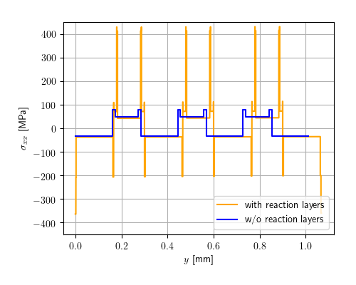

### Effect of reaction layers on internal stresses in co-fired multilayers of calcium manganate and calcium cobaltite
*Supplementary materials: Abaqus simulation files*

**For the simulation run the following steps:**

```
git clone https://github.com/BAMresearch/MultilayerInternalStresses.git

cd MultilayerInternalStresses

unzip without-reaction-layers.zip

unzip with-reaction-layers.zip

abaqus j=without-reaction-layers cpus=[Number of CPUs]

abaqus j=with-reaction-layers cpus=[Number of CPUs]
```
- Primary data for curve generation is stored in *.rpt files
- Mesh data (Node coordinates and element table, node sets and element sets) are compressed in the *.zip files

Distribution of internal stresses in the multilayers calculated by FEM with and without consideration of reaction layers in terms of orthogonal normal stress in x-direction

a) left half of the contour plot of multilayer without reaction layers


b) normal stress in x-direction



The files are released under the CC BY 4.0 license.
